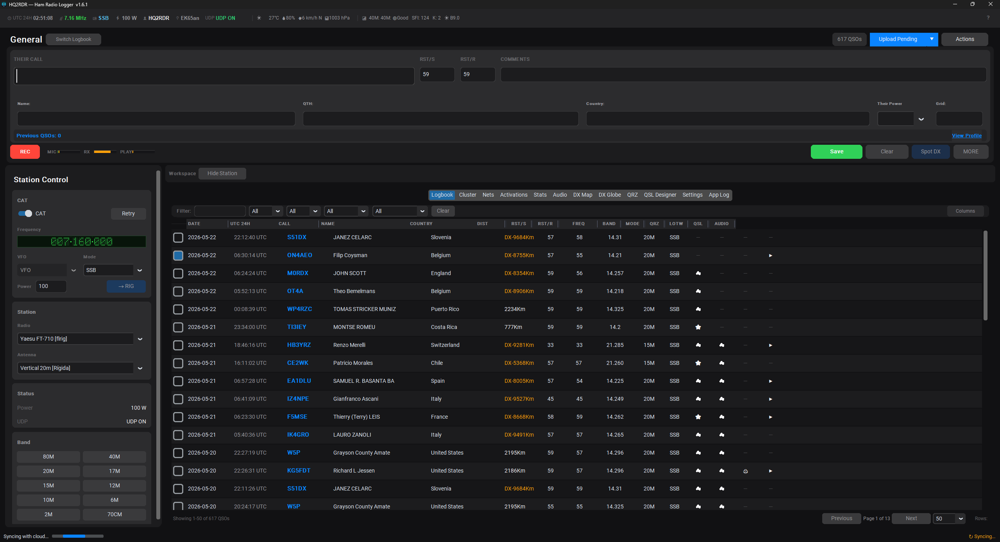
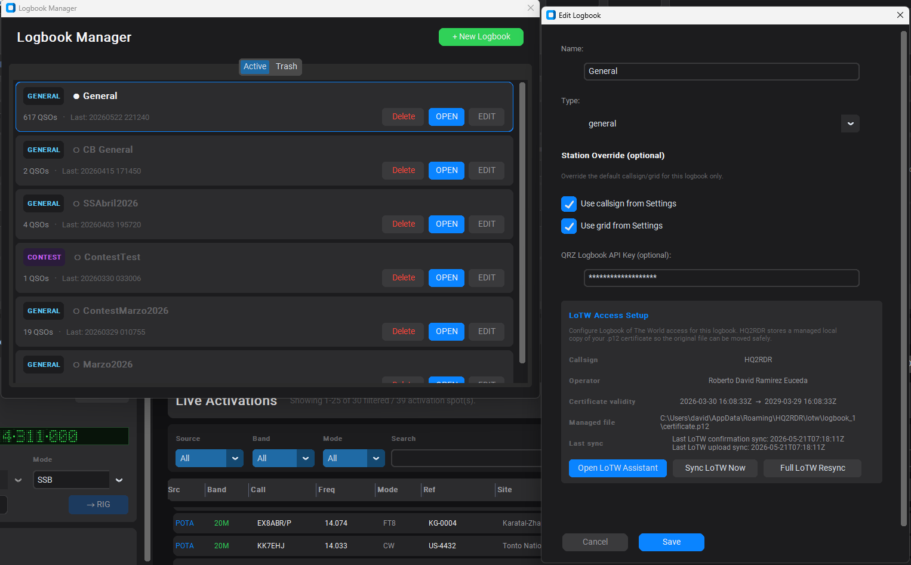
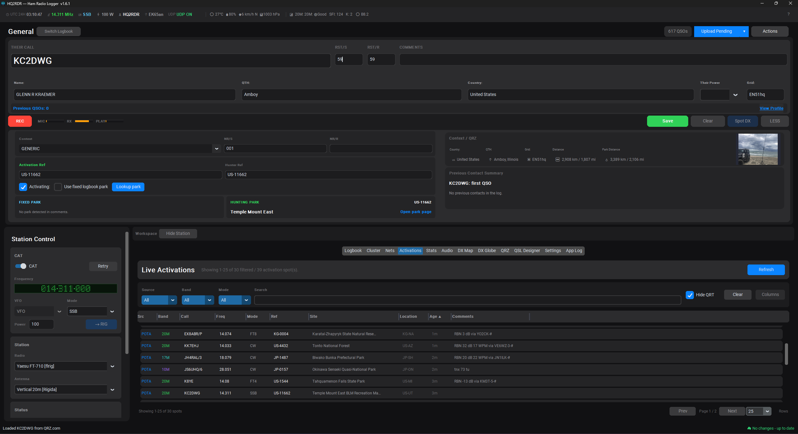
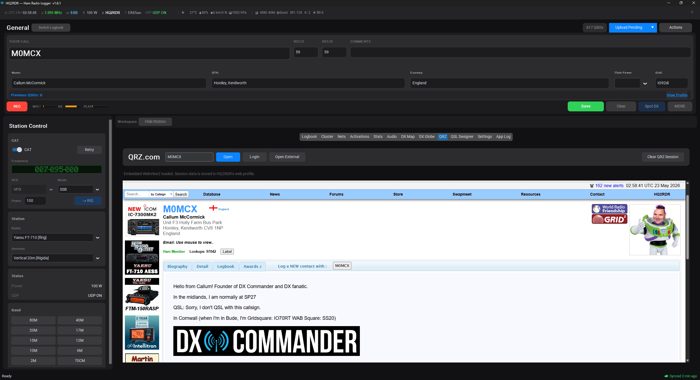
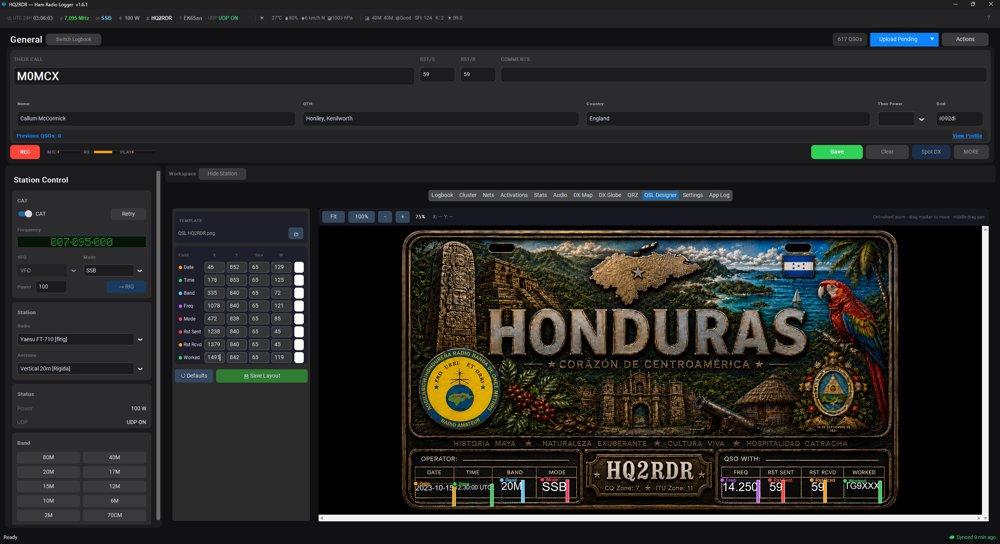
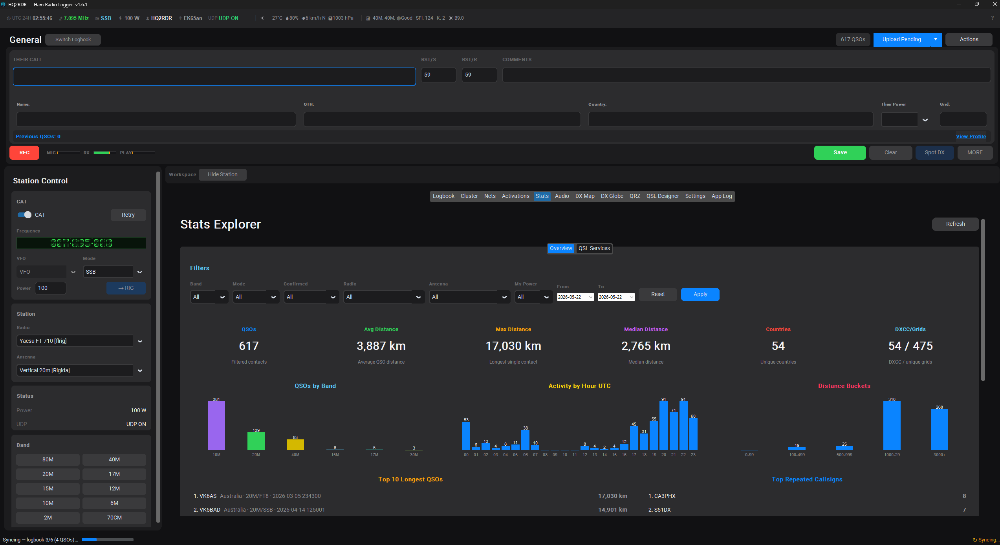
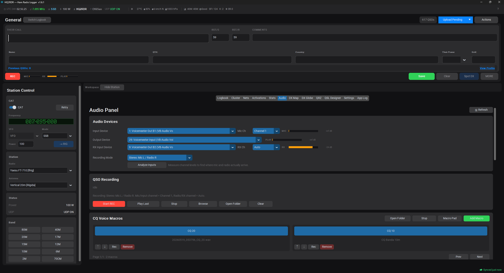
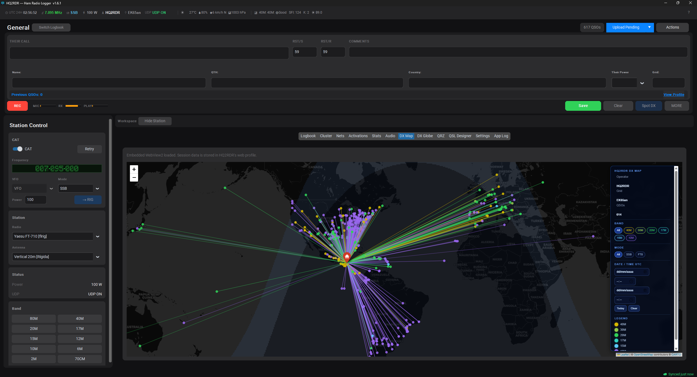
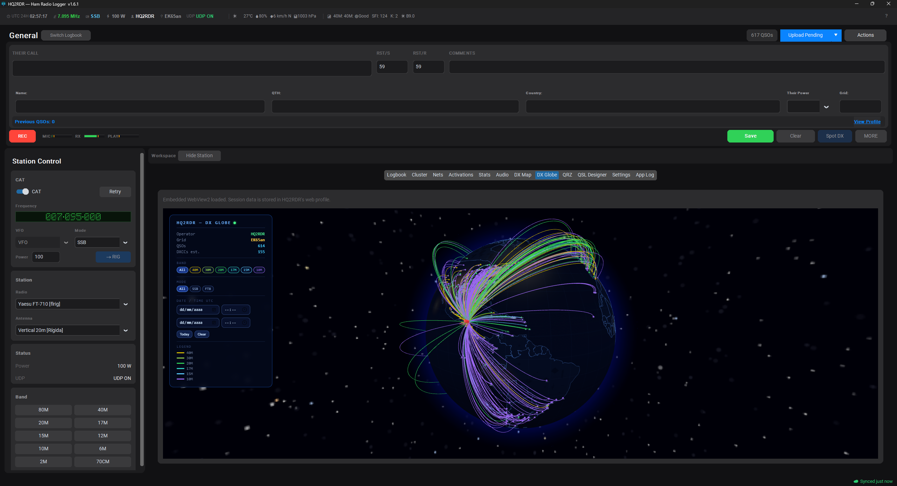
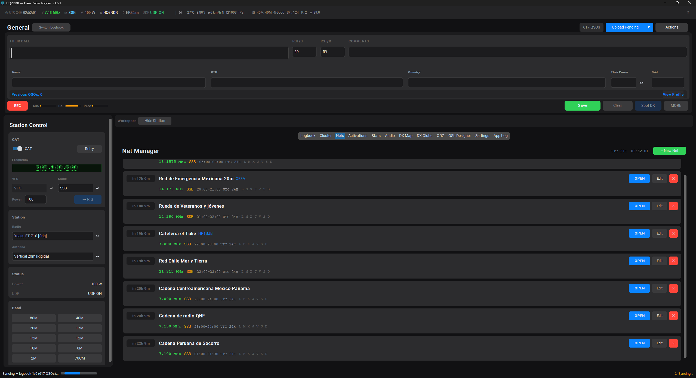

# HQ2RDR Logger & QSL Pro

**Current stable version:** `2.2.0`

HQ2RDR is a desktop ham radio logger for everyday operating, DXing, activations, nets, contest-style sessions, QSL workflows, and station management. It brings logging, CAT control, QRZ, LoTW, DX Cluster, POTA/SOTA activations, maps, audio recording, statistics, and QSL card generation into one dark-themed app.

Developed by **RhemaCode**.

- English website: https://rhemacode.com/en/hq2rdr-logger
- Sitio en español: https://rhemacode.com/es/hq2rdr-logger
- Support: contacto@rhemacode.com

## Download

Download the latest builds from the [Releases page](https://github.com/RhemaCode-dev/HQ2RDR-Releases/releases).

Stable `2.2.0` is published for Windows and Linux:

- [Windows Installer](https://github.com/RhemaCode-dev/HQ2RDR-Releases/releases/download/v2.2.0/HQ2RDR_Setup_v2.2.0.exe)
- [Linux x64 Portable ZIP](https://github.com/RhemaCode-dev/HQ2RDR-Releases/releases/download/v2.2.0/HQ2RDR_Linux_x64_v2.2.0.zip)

The app also includes a channel-aware updater. Use `Settings` to choose the stable or beta update channel.

## Screenshots

### Fast QSO Logging

### Logbook Management

### Live Activations

### QRZ Lookup And Web Session

### QSL Designer

### Statistics

### Audio Recording

### DX Map

### DX Globe

### Nets

## Main Features

- **Fast QSO capture:** callsign, RST, comments, name, QTH, country, power, grid, duplicate checks, and previous-contact context.
- **Multiple logbooks:** create, switch, filter, edit, import/export ADIF, and keep different operating activities separated.
- **Station Control:** CAT, frequency, mode, power, VFO, station radio, station antenna, and band quick-selects in a dedicated dock.
- **CAT integration:** FLRig and rigctld-compatible workflows for reading and sending radio state.
- **Digital auto-log:** WSJT-X, JTDX, and MSHV logging through UDP/ADIF broadcasts.
- **QRZ.com:** callsign lookup, profile data, photos, cache, embedded QRZ tab, logbook uploads, and confirmation workflows.
- **LoTW:** TrustedQSL-assisted uploads and confirmation matching where configured.
- **DX Cluster:** configurable cluster hosts, filters, color-coded spots, reconnect handling, and Spot DX from the logger.
- **POTA/SOTA activations:** live activation tables, fixed park workflows, hunter references, park lookup, and distance context.
- **QSL Designer:** custom card templates, boxed field positioning, preview, batch JPG output, and email delivery.
- **Maps and globe:** 2D DX Map and 3D DX Globe with paths, filters, distance context, and gray-zone support.
- **Audio:** QSO recording, MIC/RX/PLAY meters, and recording feedback in the logger.
- **Statistics:** DXCC, WAS, WAC, bands, modes, dates, confirmations, equipment, power, and distance summaries.
- **Weather and propagation:** UTC clock, weather from grid, HamQSL propagation, SFI, K-index, and status-bar indicators.
- **Cloud sync:** optional paid multi-device sync with license activation and retry handling.
- **Bilingual UI:** English and Spanish interface plus bundled user guides.

## What's New In 2.2.0

- Route-aware solar geometry now samples UTC solar elevation along the great-circle path for more meaningful geographic and seasonal forecast differences.
- Antenna-profile guidance evaluates low/elevated dipoles, verticals, and directional/Yagi antennas against the calculated take-off angle.
- Antenna selection remains separate from the ionospheric model and never changes MUF, FOT, or LUF.
- Find Duplicates now shows every probable group with stored IDs, time, frequency, RST, location, and sync/QSL state.
- Canonical desktop underscore IDs and legacy mobile hyphen IDs are labeled explicitly.
- Deleting one reviewed copy requires confirmation and uses the existing Cloud Sync deletion queue.
- Same-station contacts more than 60 seconds apart are no longer grouped as duplicate candidates.

## What's New In 1.6.4

- QSL Designer layouts now use percentage-based coordinates so fields scale across template resolutions.
- Field placement uses draggable boxes with centered text and grouped font sizing for a more consistent card look.
- Generated QSL cards now use compact JPG output with proportional resizing for email-friendly attachments.
- Logbook row context menus can generate, send, or generate-and-send QSL cards for a row or current selection.
- QSL email attachments now use the correct MIME type for generated JPG files.

## What's New In 1.6.3

- Updated About, installer metadata, cloud license messages, sync validation messages, and support links to use RhemaCode branding.
- Replaced old personal email references with `contacto@rhemacode.com`.
- Added official bilingual product links for English and Spanish users.
- Refreshed English and Spanish user guides for the current 1.6.x interface and workflows.

## What's New In 1.6.2

- Refined the QSO capture form into a faster operating flow: callsign, RST/S, RST/R, comments, then name, QTH, country, correspondent power, and grid.
- Removed duplicate radio and antenna controls from the QSO MORE panel; station radio and antenna now remain in the Station Control dock.
- Reduced MORE to advanced contest, activation, park, QRZ, and previous-contact context.
- Added a previous-contact summary with previous QSO count, last QSO, worked bands, modes, and last saved note when available.
- Compacted POTA fixed/hunting park cards and QRZ context so more workspace remains visible while MORE is open.
- Aligned callsign, RST, and comments fields vertically for cleaner live operation.
- Updated this release repository documentation with screenshots and feature summaries.

## Stable Changelog

### 2.2.0 — 2026-07-23

- Route/date-aware HF solar geometry and independent antenna suitability guidance.
- Actionable duplicate-QSO review with stored unique-ID format labels.
- Confirmed single-copy deletion through the existing Cloud Sync queue.
- Time-aware duplicate matching that preserves legitimate repeat contacts.

### 2.1.0 — 2026-07-17

- Interactive route-based HF propagation prediction and 24-hour band guidance.
- Linux x64 portable release packaging and update metadata.
- Native .NET Net Manager workflows.
- True desktop UI scaling and compact-screen improvements.
- Expanded DX Map, DX Globe, Station Control, and contest-entry workflows.

### 1.6.4 — 2026-05-26

- Resolution-independent QSL Designer layouts with boxed field editing.
- Uniform grouped QSL font sizing and centered text rendering.
- Compact JPG QSL output with proportional resizing for smaller email attachments.
- Logbook context actions for generating and sending QSL cards.
- Correct MIME metadata for JPG QSL email attachments.

### 1.6.3 — 2026-05-22

- RhemaCode branding and support contact updates.
- Official English and Spanish product page links.
- Refreshed user guides for the 1.6.x workbench and logging workflow.
- Release documentation points users to RhemaCode support and product pages.

### 1.6.2 — 2026-05-22

- New compact QSO capture layout.
- New previous-contact summary in MORE.
- More focused, shorter MORE panel for contest, activation, park, QRZ, and history context.
- Improved visual alignment of callsign, RST, and comments fields.
- Public release README and screenshots are now generated from versioned documentation.

### 1.6.1 — 2026-05-21

- Rebuilt DX Map as a live Leaflet view without periodic full-page reloads.
- Added DX Map filters for band, mode, and date/time.
- Improved DX Map hover details with callsign, band, mode, date/time, grid, location, comment, and distance.
- Fixed gray-zone rendering and short-path drawing across wrapped map views.
- Added MIC, RX, and PLAY audio meters in the Audio tab and QSO action bar.
- Added configurable columns for logbook and DX Cluster tables.
- Improved activation and cluster table usability.

### 1.6.0 — 2026-05-21

- Introduced the stable 1.6 workbench with fixed QSO entry and integrated workspace tabs.
- Added the Station Control dock for CAT, radio, antenna, rig status, and quick band controls.
- Expanded audio recording workflows.
- Improved POTA/SOTA live activation views.
- Added integrated bilingual help.
- Promoted recent beta stability and layout improvements into the stable channel.

## Installation Notes

### Windows

Download and run `HQ2RDR_Setup_v2.2.0.exe`. The installer upgrades an existing HQ2RDR installation while preserving its application identity.

### Linux

Download `HQ2RDR_Linux_x64_v2.2.0.zip`, extract it, make the `HQ2RDR` binary executable if needed, and run it. The package is self-contained for Linux x64; embedded web views may still require distribution-provided GTK/WebKit components.

### macOS

macOS support exists through the PyInstaller spec, but macOS release artifacts may be published manually depending on build availability.

## First Run Checklist

1. Open `Settings`.
2. Set your operator callsign and grid.
3. Configure QRZ credentials if you use QRZ lookup or uploads.
4. Configure LoTW/TrustedQSL if you upload to LoTW.
5. Add station radios and antennas.
6. Configure CAT if you want rig frequency/mode integration.
7. Choose your update channel: stable or beta.

## Support And Diagnostics

- Use the built-in `App Log` tab for diagnostic messages.
- Use the integrated help guide from the `?` button.
- For release downloads, use this repository's [Releases page](https://github.com/RhemaCode-dev/HQ2RDR-Releases/releases).
- Official English product page: https://rhemacode.com/en/hq2rdr-logger
- Pagina oficial en español: https://rhemacode.com/es/hq2rdr-logger
- Support: contacto@rhemacode.com
- For source code and development history, see [HQ2RDR](https://github.com/RhemaCode-dev/HQ2RDR).
